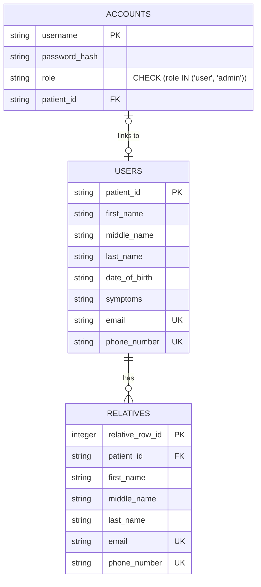
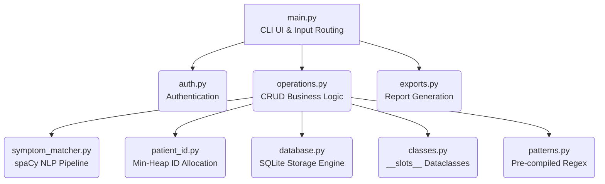

# Hospital Records Manager

A comprehensive, terminal-based Command Line Interface (CLI) application for securely managing patient records, diagnostic symptom matching, and hospital administrative operations. 

Built as a highly optimized, single-node local application, this project emphasizes robust Object-Oriented Programming (OOP) principles, algorithmic efficiency, and relational data integrity using Python and SQLite.

## 🎯 Overview

This system acts as a centralized local ledger for patient demographics, family (relative) linkages, and disease diagnosis mapping. It features a complete authentication pipeline with Role-Based Access Control (RBAC), distinguishing between standard `user` and `admin` privileges. 

Key technical implementations include Natural Language Processing (NLP) for symptom-to-disease extraction via **spaCy**, cryptographic password hashing via **PBKDF2**, and dynamic ID recycling utilizing a **Min-Heap** data structure.

---

## ✨ Core Features

- **Role-Based Authentication:** Distinct User and Admin flows. Admin accounts can perform unrestricted CRUD operations across the entire database, while Users are isolated to managing their own profiles and linked relatives.
- **NLP Symptom Matching:** Parses unstructured, free-text patient symptom descriptions (up to 750 words) to automatically derive and assign precise diagnostic disease codes.
- **Relational Data Mapping:** Enforces strict Foreign Key constraints between Patient profiles and their respective Relatives, supporting cascading deletions to prevent orphaned records.
- **Algorithmic ID Allocation:** Ensures zero namespace fragmentation. As patient records are deleted, their unique identifiers are pushed to a priority queue (Min-Heap) for $O(\log N)$ reassignment.
- **Multi-Format Export Pipeline:** Supports generating medical reports in `.pdf`, `.docx`, `.csv`, and `.txt` formats, featuring abstract layout builders for both single-patient and bulk-admin exports.

---

## 🏗️ Technical Architecture

### Entity-Relationship Model

The underlying storage engine utilizes **SQLite3** with explicit schema definitions, indexing for $O(\log N)$ query times, and enforced uniqueness across critical PII (Emails and Phone Numbers).



### Component Flow

The application logic is heavily decoupled into specialized modules, ensuring strict separation of concerns between the CLI UI drivers, business logic, and data access layers.



---

## 🚀 Engineering Highlights

*   **Memory Optimization:** Core data structures (`User`, `Relatives`) are implemented using Python's `__slots__` to suppress dynamic dictionary creation, drastically reducing the memory footprint per loaded entity.
*   **NLP Pipeline Tuning:** The `spaCy` text-processing pipeline is explicitly configured to bypass heavy, unneeded neural network components (`ner`, `parser`, `tagger`), isolating the `PhraseMatcher` for ultra-low latency token matching on massive text inputs.
*   **Cryptographic Standards:** Passwords are never stored in plaintext. The system utilizes `hashlib.pbkdf2_hmac` with `SHA-256`, salted, and subjected to **600,000 iterations** to strictly conform to modern NIST security guidelines.
*   **Exhaustive Test Coverage:** The repository contains a comprehensive suite of unit and integration tests powered by `pytest`. Standard libraries like `unittest.mock` are used extensively to simulate STDIN interactions, isolate database I/O, and validate error handling.

---

## ⚙️ Installation & Setup

### Requirements
- Linux / POSIX environment (Tested on Pop!_OS / Ubuntu)
- Python 3.12+

### Setup Instructions

1. **Clone the repository:**
   ```bash
   git clone https://github.com/PratheekPoojari/Hobby_Projects.git
   cd Hobby_Projects/CLI_Contacts
   ```

2. **Initialize a Virtual Environment:**
   ```bash
   python3 -m venv venv
   source venv/bin/activate
   ```

3. **Install Dependencies:**
   ```bash
   pip install -r requirements.txt
   ```
   *(Note: The NLP engine requires downloading the core English web model.)*
   ```bash
   python3 -m spacy download en_core_web_sm
   ```

---

## 🕹️ Usage

To launch the application, ensure your virtual environment is active and run the main entry point:

```bash
python3 src/main.py
```

*By default, all new sign-ups are granted `user` level access. `admin` accounts must be configured directly via database insertion to maintain strict administrative isolation.*

## 🧪 Testing

To run the automated test suite, ensure development dependencies (like `pytest` and `pytest-mock`) are installed from `requirements_dev.txt`, then execute:

```bash
pytest -v tests/
```
